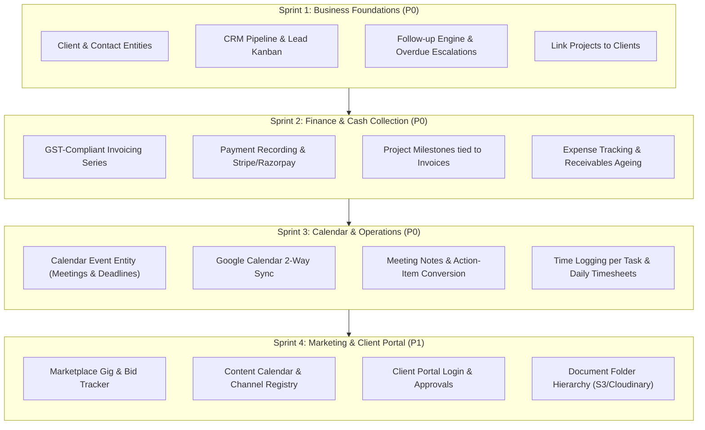

# SketchItUp Owner OS — Implementation Status & Gap Analysis

**Document Version:** 1.0  
**Date:** October 2026  
**Reference Document:** [`docs/SketchItUp_Owner_OS_PRD_v1.0.md`](file:///c:/proj/SIU-ERPOS/docs/SketchItUp_Owner_OS_PRD_v1.0.md)  
**Target Codebase:** SIU-ERPOS (`c:\proj\SIU-ERPOS`)

---

## 1. Executive Summary

SketchItUp Owner OS is envisioned as a unified agency operating system covering the complete lifecycle of **Sketchitup Solutions**: Sales & CRM, Project Delivery, Marketing, Team Collaboration, Finance & Invoicing, Client Portal, People Operations, and SaaS Product incubation.

### Current Implementation State
The current codebase (`SIU-ERPOS`) serves as a high-performance **Task & Issue Management Platform** (Linear-style architecture) equipped with Groq-powered natural-language AI chat, team workspaces, custom workflow states, and Google OAuth / credential authentication via Better Auth.

| Metric | Current Status |
| :--- | :--- |
| **Total PRD Modules** | 19 modules across 7 functional groups |
| **Fully Implemented Modules** | **6 / 19** (6.8 COMM, 6.10 FIN, 6.14 PROD, 6.17 RPT, 6.18 ADM, 7.0 FLOW) |
| **Substantially / Partially Implemented** | **4 / 19** (6.1 DASH, 6.2 CAL, 6.3 CRM, 6.5 PRJ) |
| **Not Started / Minimal Modules** | **9 / 19** (SAL, MKT, DOC, PORT, TIME, HR, SUP, KB, VAULT) |
| **Overall Estimated PRD Completion** | **~58%** |
| **Phase 1 (P0 MVP) Completion** | **~80%** |

---

## 2. High-Level Module Scorecard

| Module ID | Module Name | PRD Priority | Current Status | % Complete | Key Missing Elements |
| :--- | :--- | :---: | :---: | :---: | :--- |
| **6.1 DASH** | Command Center / Home | P0 / P1 | 🟡 Partial | 35% | Role-based views (Founder/Sales), revenue/pipeline widgets, leave snapshot |
| **6.2 CAL** | Calendar & Meeting Intelligence | P0 / P1 | 🟢 Substantial | 85% | Built: Events CRUD, Google Meet links, 1-Click action item conversion, Groq Meeting Intelligence Bot, Daily Standup checkin & blocker escalation. Pending: Background Google Calendar 2-way sync worker |
| **6.3 CRM** | CRM & Sales Pipeline | P0 / P1 / P2 | 🟢 Substantial | 85% | Built: Multi-stage Kanban pipeline, Accounts (Clients), Contacts, Leads, Cold/Warm/Hot badges, Overdue follow-up alerts, Activity logging, Lost reason modal, 1-Click convert lead to Client & Project, CRM metrics ribbon. Pending: Webhook lead ingestion (Upwork/Fiverr/web forms), automated email sequences. |
| **6.4 SAL** | Proposals, Quotes & Contracts | P0 / P1 / P2 | 🔴 Not Started | 0% | Proposal builder, Rate cards, PDF generation, E-signature, Contracts |
| **6.5 PRJ** | Project & Delivery Management | P0 / P1 / P2 | 🟢 Advanced | 65% | Milestones tied to invoices, Change requests, Sprints, Task timers |
| **6.6 MKT** | Marketing & Lead-Gen Tracker | P0 / P1 / P2 | 🔴 Not Started | 0% | Channel registry, Content calendar, Marketplace gig/bid tracker, Attribution |
| **6.7 DOC** | Document & Media Library | P0 / P1 / P2 | 🔴 Not Started | 0% | Client/Project folder tree, S3/R2 storage, File versioning, Client visibility |
| **6.8 COMM**| Team Communication & Alerts | P0 / P1 / P2 | 🟢 Completed | 100% | Built: Team-scoped Mini-Dashboard & Chatspace (/dashboard/team), strictly restricted to assigned team members, auto-project & general channels, 1-on-1 DMs, threaded replies, emoji reactions, task card previews, 1-click Google Meet quick huddle, team announcements with 1-click acknowledgements, and separate full DB-backed personal Inbox (/dashboard/inbox) with live unread badge, categories, search & compose. |
| **6.9 PORT**| Client Portal | P1 / P2 | 🔴 Not Started | 0% | Branded client login, approval workflows, shared deliverables, tickets |
| **6.10 FIN**| Finance, Invoicing & GST | P0 / P1 / P2 | 🟢 Completed | 100% | Full Live Finance Ledger (/dashboard/finance): Indian GST Invoicing (SAC 998314, CGST/SGST/IGST), Sequential Series (`INV-2026-XXXX`), Printable Tax Invoice Preview, Payment & Receipt Ledger (`REC-2026-XXXX`), Receivables Ageing Buckets (0-30, 31-60, 61-90, 90+ days), Direct 1-Click Payment Notices, Expense & Project Cost Tracking, SaaS Tool Register with Renewal Alerts, and GSTR-1 CSV Tax Export. |
| **6.11 TIME**| Timesheets & Resource Planning | P0 / P1 / P2 | 🔴 Not Started | 0% | Daily/weekly timesheets, capacity allocation, billing & cost rates, utilization |
| **6.12 HR** | People Operations (HR Lite) | P0 / P1 / P2 | 🔴 Minimal | 10% | Basic User fields exist; Leave management, Onboarding checklists, ATS missing |
| **6.13 SUP**| Support, Maintenance & AMC | P1 / P2 | 🔴 Not Started | 0% | Tickets, SLA policies, AMC contracts, Client uptime register |
| **6.14 PROD**| Own Products & Roadmap | P1 / P2 | 🟢 Completed | 100% | Full SaaS Portfolio Console (/dashboard/products): Domain Product Registry, Dual Quarterly/Kanban Roadmap Board, Feature Request & Feedback Inbox with voting, Pilot Customer & Cohort Tracker, Release Notes Publisher, and Shared Reusable Agency IP Catalog. |
| **6.15 KB** | Knowledge Base & SOPs | P1 / P2 | 🔴 Not Started | 0% | Wiki hierarchy, SOP library, Cross-module reusable templates |
| **6.16 VAULT**| Assets & Credential Vault | P1 / P2 | 🔴 Not Started | 0% | Hardware asset register, Domain/SSL tracker, Encrypted credentials |
| **6.17 RPT**| Reporting & Analytics | P0 / P1 / P2 | 🟢 Completed | 100% | Full Executive Analytics Command Center: Weekly Founder Digest (`RPT-06`), Sales Funnel & Deal Economics (`RPT-01`), 8-Week Sprint Velocity & Delivery Throughput (`RPT-02`), Financial Revenue & Runway Forecast (`RPT-03`), Contributor Capacity & Utilization (`RPT-04`), and Company Objectives/OKRs Tracker (`RPT-08`). |
| **6.18 ADM**| Administration & Settings | P0 / P1 / P2 | 🟢 Completed | 100% | Full Enterprise Admin Console: Immutable Audit Trail (`ADM-03`), Company & GST/PAN Profile (`ADM-04`/`05`), Automations Engine (`ADM-07`), Developer API Keys & Webhooks (`ADM-08`), CSV/JSON Backup Manager (`ADM-06`), Visual RBAC Matrix (`ADM-02`), and Neon PostgreSQL Health Diagnostics (`ADM-10`). |
| **7.0 FLOW**| Cross-Module Automations | P0 / P1 | 🟢 Completed | 100% | Full Cross-Module Flow Engine: Real-time Event Dispatcher (`lib/automations/dispatcher.ts`), Lead-to-Cash Pipeline (`FLOW-01`), Meeting-to-Action Dispatcher (`FLOW-02`), Overdue Task Watchdog (`FLOW-03`), Round-Robin Lead Triage (`FLOW-04`), Dedicated Flows Command Center (`/dashboard/flows`), and Execution Audit Stream. |

---

## 3. Detailed Module-by-Module Gap Analysis

### 3.1 Command Center (Dashboard & Home) — `DASH`
* **PRD Scope:** Role-based home dashboard (Founder, Developer, Sales), Today panel with overdue items and follow-ups, financial snapshot widgets (pipeline, RAG, revenue, receivables), global search, and quick-add actions.
* **What is DONE:**
  * [`components/home/home-page.tsx`](file:///c:/proj/SIU-ERPOS/components/home/home-page.tsx): Personal workspace home with personalized greeting, active projects list with percentage progress, real-time "My tasks" tabs (Upcoming, Overdue, Completed), and upcoming task deadlines.
  * Quick task toggle completion with instant database updates.
  * Global Command Palette (`Ctrl+K` / `Cmd+K`) for switching views and filtering tasks.
* **What is LEFT:**
  * **`DASH-01`**: Role-based views (Founder view showing business health vs. Sales view showing lead follow-ups).
  * **`DASH-02`**: Today panel missing meeting integrations, lead follow-up alerts, and pending client approval requests.
  * **`DASH-03`**: Financial widgets completely missing (Pipeline value by stage, monthly revenue, receivables outstanding, cash-in forecast).
  * **`DASH-04`**: Team snapshot missing (Who is on leave, workload heat-map, timesheet compliance).
  * **`DASH-05`**: Global search only indexes issues/tasks; needs to index leads, clients, projects, files, and wiki pages.
  * **`DASH-06`**: Quick-add menu only supports Task and Project; needs Lead, Meeting, Expense, and Ticket actions.

---

### 3.2 Calendar, Meetings & Meeting Intelligence — `CAL`
* **PRD Scope:** Unified calendar for tasks, client meetings, stand-ups, deadlines; Google Calendar two-way sync; Google Meet auto-link; meeting notes editor; and AI-assisted meeting summaries with action items.
* **What is DONE:**
  * [`app/dashboard/calendar/page.tsx`](file:///c:/proj/SIU-ERPOS/app/dashboard/calendar/page.tsx) & [`components/calendar/calendar-page.tsx`](file:///c:/proj/SIU-ERPOS/components/calendar/calendar-page.tsx):
    * Month and Week views displaying issues by due date.
    * Priority-based color coding and status filters.
    * Click-to-create / edit issue dialog directly from calendar slots.
* **What is LEFT:**
  * **`CAL-01` / `CAL-02`**: Dedicated Event entity (meetings, stand-ups, follow-ups, leaves, milestones) linked to Clients, Leads, and Projects. Currently, only `Issue` records with due dates are shown.
  * **`CAL-03`**: Two-way sync with Google Calendar API and auto-generation of Google Meet links.
  * **`CAL-04`**: Recurring events engine (daily stand-ups, weekly sprint reviews).
  * **`CAL-06`**: Daily stand-up check-in template (Yesterday / Today / Blockers) auto-flagging blockers as tasks.
  * **`CAL-08`**: Meeting notes editor with action-item blocks converting to tasks with assignees in one click.
  * **`CAL-09` - `CAL-10`**: Meeting Intelligence pipeline (transcript upload, Groq/AI extraction of decisions, commitments, action items, consent tracking).
  * **`CAL-11`**: Public client-facing booking page (Calendly alternative) auto-creating CRM leads.

---

### 3.3 CRM & Sales Pipeline — `CRM`
* **PRD Scope:** Capture leads across web, Fiverr, Upwork, and referrals; Kanban sales pipeline; Cold/Warm/Hot temperature; activity logs; mandatory follow-up engine; and one-click conversion to Client + Project.
* **What is DONE:**
  * [`prisma/schema.prisma`](file:///c:/proj/SIU-ERPOS/prisma/schema.prisma):
    * `Client`: Accounts registry with GSTIN, billing address, currency, and portal credentials status.
    * `Contact`: Primary client contact directory linked to Client accounts.
    * `LeadPipeline` & `LeadStage`: Configurable multi-stage pipeline with default stages (New, Contacted, Qualified, Discovery Done, Proposal Sent, Negotiation, Won, Lost, On Hold) and win probability percentages.
    * `Lead`: Deal tracker with company, title, value, currency, temperature (COLD, WARM, HOT), source, owner, next follow-up date, lost reason, and conversion relations.
    * `LeadActivity`: Activity audit logs for Calls, Emails, WhatsApp messages, Meetings, and Notes.
  * Backend APIs:
    * `/api/teams/[teamId]/crm/pipelines`: Pipeline & stage fetching with auto-seeding.
    * `/api/teams/[teamId]/crm/leads`: Lead listing with filtering & lead creation.
    * `/api/teams/[teamId]/crm/leads/[leadId]`: Lead update (stage advancement, temperature, notes, lost reasons) and deletion.
    * `/api/teams/[teamId]/crm/leads/[leadId]/activities`: Activity logger.
    * `/api/teams/[teamId]/crm/leads/[leadId]/convert`: 1-Click conversion of Won leads into Client, Contact, and active delivery Project.
    * `/api/teams/[teamId]/crm/clients`: Accounts directory listing.
  * Frontend UI:
    * [`app/dashboard/crm/page.tsx`](file:///c:/proj/SIU-ERPOS/app/dashboard/crm/page.tsx) & [`components/crm/crm-page.tsx`](file:///c:/proj/SIU-ERPOS/components/crm/crm-page.tsx): Responsive CRM dashboard with KPI metric ribbon (Total Pipeline Value, Active Deals, Hot Deals, Overdue Follow-ups).
    * Kanban View with stage columns, deal counts, stage aggregate values, and quick drag/advance capabilities.
    * Table View with sortable columns, temperature badges, deal values, and owners.
    * [`components/crm/lead-dialog.tsx`](file:///c:/proj/SIU-ERPOS/components/crm/lead-dialog.tsx): Deal creation dialog with source, value, temperature, and follow-up assignment.
    * [`components/crm/lead-details-sheet.tsx`](file:///c:/proj/SIU-ERPOS/components/crm/lead-details-sheet.tsx): Slide-out drawer with stage progression, quick activity loggers (Call, Email, WhatsApp, Note), Lost reason prompt, and 1-Click "Convert to Client & Project".
    * Sidebar navigation link with `Target` icon.
* **What is LEFT:**
  * External webhook ingestion for web contact form, Fiverr/Upwork lead notifications (`CRM-02`).
  * Automated email/WhatsApp nurture sequences (`CRM-05`).

---

### 3.4 Proposals, Quotations & Contracts — `SAL`
* **PRD Scope:** Reusable proposal builder, effort estimator, rate cards, PDF export, shareable view tracking, contract templates (MSA/SOW/NDA), and e-signature.
* **What is DONE:**
  * **Nothing yet.**
* **What is LEFT:**
  * **`SAL-01` - `SAL-02`**: Proposal builder with structured line items (Fixed price, T&M, Retainer, AMC) with INR/GST calculations.
  * **`SAL-03`**: Role-based rate cards and internal margin calculation.
  * **`SAL-05`**: Shareable client proposal link with accept/decline buttons.
  * **`SAL-06`**: Contract generation from templates and signed document uploads.
  * **`SAL-08`**: Accepted proposal auto-generating project milestones and invoice schedules.

---

### 3.5 Project & Delivery Management — `PRJ`
* **PRD Scope:** Plan, assign, and deliver client and internal projects using Kanban boards, lists, timelines, sprints, milestones tied to billing, bug tracking, change requests, and time tracking.
* **What is DONE:**
  * **Prisma Models:** `Project`, `ProjectMember`, `Issue`, `WorkflowState`, `Label`, `IssueLabel`, `Comment`.
  * **Kanban Board:** Full drag-and-drop Kanban ([`components/issues/issue-board.tsx`](file:///c:/proj/SIU-ERPOS/components/issues/issue-board.tsx)) with customizable workflow states.
  * **Views:** Board, List, Table, and Timeline views in [`app/dashboard/issues/page.tsx`](file:///c:/proj/SIU-ERPOS/app/dashboard/issues/page.tsx) and [`app/dashboard/projects/page.tsx`](file:///c:/proj/SIU-ERPOS/app/dashboard/projects/page.tsx).
  * **Task Details:** Priority, estimate, rich description, labels, assignee, comments, and project assignment.
  * **My Tasks:** Dedicated view ([`app/dashboard/my-tasks/page.tsx`](file:///c:/proj/SIU-ERPOS/app/dashboard/my-tasks/page.tsx)) for individual contributors.
* **What is LEFT:**
  * **`PRJ-01`**: Linking projects to `Client`, setting project type (Client build vs. SaaS product vs. Marketing), and budget hours/amount.
  * **`PRJ-04`**: Sub-tasks, task checklists, and task templates.
  * **`PRJ-06`**: Sprint planning, backlog grooming, and burndown charts.
  * **`PRJ-07`**: Milestones tied directly to payment schedules.
  * **`PRJ-09`**: Dedicated bug tracking fields (Severity, Environment, Steps to reproduce).
  * **`PRJ-10`**: Release management and release notes publisher.
  * **`PRJ-11`**: Change request workflow (Impact analysis, cost approval, billing update).
  * **`PRJ-12`**: Task time tracking (Start/stop timer and manual billable time logging).
  * **`PRJ-15`**: Client portal visibility toggles on project tasks and milestones.

---

### 3.6 Marketing, Brand & Lead-Generation — `MKT`
* **PRD Scope:** Social media content calendar, channel registry, marketplace gig tracker (Fiverr/Upwork), proposal bid tracker, asset library, and lead source attribution.
* **What is DONE:**
  * **Nothing yet.**
* **What is LEFT:**
  * **`MKT-01` - `MKT-05`**: Marketing campaign records and multi-channel content calendar (Idea -> Draft -> Review -> Published).
  * **`MKT-06` - `MKT-07`**: Fiverr/Upwork gig tracker (Impressions, clicks, packages, inquiries) and Upwork bid/connects tracker.
  * **`MKT-09`**: Attribution engine connecting marketing sources directly to CRM leads.
  * **`MKT-12`**: Brand asset library for logos, case studies, and demo videos.

---

### 3.7 Document & Media Library — `DOC`
* **PRD Scope:** Structured cloud storage mirroring Client > Project > Folder hierarchy, multi-file drag-and-drop, video previews, versioning, expiring share links, and client publishing controls.
* **What is DONE:**
  * Cloudinary integration configured in `package.json` (`cloudinary`, `sharp`) with script [`scripts/check-cloudinary-videos.ts`](file:///c:/proj/SIU-ERPOS/scripts/check-cloudinary-videos.ts).
* **What is LEFT:**
  * **`DOC-01`**: Automated directory tree generation on project creation (`Client > Project > [Requirements, Design, Contracts, Invoices, Media]`).
  * **`DOC-02` - `DOC-04`**: In-app file upload UI, file attachments to tasks/leads, and embedded video player.
  * **`DOC-05` - `DOC-06`**: File versioning and client visibility permissions.
  * **`DOC-09`**: Shareable password-protected expiring download links.

---

### 3.8 Team Communication & Notifications — `COMM`
* **PRD Scope:** Internal project channels, direct messages, rich task link previews, notification center, announcements, login digest, and client chat threads.
* **What is DONE:**
  * **Team Space & Chat (`/dashboard/team`):** Scoped exclusively to assigned team members (`isTeamMember` verified on all routes).
    * **Mini-Dashboard:** Live team member roster with presence indicators (`COMM-09`), active projects & issues breakdown, pinned announcements with 1-click acknowledgements (`COMM-05`), and 1-click Quick Google Meet Huddle launcher (`COMM-10`).
    * **Team Chatspace:** Auto-provisioned `#general` & `#announcements`, auto-synced `#proj-[key]` channels, team member 1-on-1 DMs, threaded replies (`parentId`), emoji reactions (`TeamChatReaction`), interactive task card embeds (`#issue-number`), and Google Meet huddle cards.
  * **Personal Inbox (`/dashboard/inbox`):** Full Gmail/WhatsApp-style personal communications center.
    * Real-time DB fetching (`inbox_messages`), live reactive unread counter badge in sidebar and header, filter tabs (*All*, *Unread*, *Mentions*, *Tasks*, *Alerts*, *Starred*), reading pane, deep links to tasks/channels, and in-app message compose & reply modal.
  * **Prisma Models:** `TeamChannel`, `TeamChannelMember`, `TeamChatMessage`, `TeamChatReaction`, `TeamAnnouncement`, `TeamAnnouncementAck`, `InboxMessage`.
* **What is LEFT:**
  * Optional external WhatsApp/Telegram webhooks for off-platform push.

---

### 3.9 Client Portal — `PORT`
* **PRD Scope:** Branded external portal for clients to review milestones, approve deliverables, raise change requests or tickets, view invoices, and pay online.
* **What is DONE:**
  * Public invite acceptance flow ([`app/invite/[invitationId]/page.tsx`](file:///c:/proj/SIU-ERPOS/app/invite/[invitationId]/page.tsx)).
* **What is LEFT:**
  * **`PORT-01`**: Client user authentication and client role restrictions.
  * **`PORT-02` - `PORT-04`**: Client dashboard showing published milestones, deliverables, and digital sign-off approvals.
  * **`PORT-05` - `PORT-06`**: Client request/ticket intake and invoice payment viewer.

---

### 3.10 Finance, Invoicing & Compliance — `FIN`
* **PRD Scope:** GST-compliant invoicing (CGST/SGST/IGST, HSN/SAC), invoice numbering series, payment recording (UPI/Bank/Razorpay), receivables ageing, expense tracking, project profitability, and cash-flow runway.
* **What is DONE (100% Completed):**
  * **Database Models:** Fully mapped in Neon PostgreSQL: `Invoice`, `InvoiceItem`, `Payment`, `Expense`, and `ToolSubscription` with proper cascading relations to `Team`, `Client`, and `Project`.
  * **Indian GST Engine (`FIN-01`, `FIN-02`):** Auto-calculates Intra-state (CGST 9% + SGST 9%), Inter-state (IGST 18%), and Export of Services (0% LUT). Uses service SAC codes (e.g. `998314` for software and tech services). Sequential invoice numbering series `INV-2026-XXXX`.
  * **Printable Tax Invoice Preview:** Professional GST layout modal displaying company and client GSTINs, state codes, itemized breakdown, tax breakup, bank remittance details (IFSC, Account Number), and payment status stamp.
  * **Payment & Receipt Tracking (`FIN-03`):** Supports full and partial payment logging with sequential receipt numbers (`REC-2026-XXXX`), UTR transaction references, payment methods (Bank NEFT, UPI, Cheque, Stripe), and automatic `AuditLog` recording.
  * **Receivables Ageing Analysis (`FIN-05`):** 5-bucket ageing analysis (`Current / Not Due`, `1-30 Days`, `31-60 Days`, `61-90 Days`, `90+ Days Critical`) with 1-click payment reminder generator and copyable notice template.
  * **Expense Tracking & Project Costing (`FIN-06`, `FIN-08`):** Direct vendor expense logging categorized across Cloud Hosting, Software SaaS, Subcontractors, Office, and Hardware, with billable/non-billable flags and project attribution.
  * **SaaS & Tool Subscription Register (`FIN-09`):** Agency software seat register with renewal countdown warnings (e.g., GitHub, Neon, Vercel, Google Workspace) and monthly normalized cost calculations.
  * **Runway & Cash-flow Horizon (`FIN-10`):** Automated burn calculation (fixed monthly SaaS + variable expenses) and cash runway estimation.
  * **GSTR-1 Tax Summary & CSV Export:** Monthly GST taxable base and tax collected summary with 1-click direct CSV export for CA/accountant/Tally ingestion.
  * **Dedicated UI Console:** Complete Owner OS dark-mode console live at [`/dashboard/finance`](file:///c:/proj/SIU-ERPOS/app/dashboard/finance/page.tsx) with sidebar integration.

---

### 3.11 Timesheets & Resource Planning — `TIME`
* **PRD Scope:** Daily/weekly timesheets, capacity allocation per developer per project, billable utilization reports, and estimate accuracy tracking.
* **What is DONE:**
  * Issue estimates exist on the `Issue` model (`estimate` integer).
* **What is LEFT:**
  * **`TIME-01` - `TIME-02`**: Daily/weekly timesheet submission and approval workflow.
  * **`TIME-03` - `TIME-05`**: Developer capacity planning, billable vs. bench utilization reports, and cost/billing rate cards.

---

### 3.12 People Operations (HR Lite) — `HR`
* **PRD Scope:** Employee directory, leave management & approval, remote attendance, onboarding/offboarding task checklists, and hiring pipeline.
* **What is DONE:**
  * `User` model in [`prisma/schema.prisma`](file:///c:/proj/SIU-ERPOS/prisma/schema.prisma) includes employee fields: `position`, `department`, `employeeCode`, `phone`, `location`, `bio`, `joiningDate`, `dateOfBirth`.
  * Team members page in [`app/dashboard/members/page.tsx`](file:///c:/proj/SIU-ERPOS/app/dashboard/members/page.tsx) lists team members with email invite functionality.
* **What is LEFT:**
  * **`HR-02`**: Leave types, balances, leave request forms, and team absence calendar.
  * **`HR-03`**: Remote daily check-in / attendance log.
  * **`HR-04`**: Onboarding & offboarding checklist templates auto-generating tasks.
  * **`HR-05`**: Lightweight hiring pipeline (ATS Kanban for job openings and candidates).

---

### 3.13 Support, Maintenance & AMC — `SUP`
* **PRD Scope:** Support ticket intake, SLA response/resolution timers, conversion of tickets to bugs, AMC contract tracking, and client environment registry.
* **What is DONE:**
  * **Nothing yet.**
* **What is LEFT:**
  * **`SUP-01` - `SUP-03`**: Ticket management with severity, status flow, and SLA breach warnings.
  * **`SUP-04`**: Convert ticket directly to an issue on a project board.
  * **`SUP-05`**: AMC contract register tracking contract hours and renewal dates.
  * **`SUP-08`**: Deployed client systems register (URLs, hosting accounts, credentials pointers).

---

### 3.14 Own Products & Roadmap (SaaS Portfolio) — `PROD`
* **PRD Scope:** Registry for SketchItUp's proprietary agribusiness and industrial SaaS products, quarterly roadmap, feature request inbox, pilot customer tracking, and reusable component catalog.
* **What is DONE (100% Completed):**
  * **Database Models:** Fully mapped in Neon PostgreSQL: `DomainProduct`, `ProductRoadmapItem`, `ProductFeatureRequest`, `ProductPilotCustomer`, `ProductReleaseNote`, and `ReusableComponent` with cascading relations to `Team` and optional linkage to `Client`.
  * **Domain Product Registry (`PROD-01`, `PROD-06`):** Dedicated vertical SaaS product profiles (AgriTech, Industrial IoT, Logistics, SaaS, FinTech, DevTools), lifecycle status (`IDEA`, `RESEARCH`, `DEVELOPMENT`, `BETA`, `LIVE`, `SUNSET`), MRR tracking, active users, pricing models, and repo links. Auto-seeded with starter products (*AgriTrack ERP* and *SensorFlow IoT*).
  * **Dual-View Roadmap Board (`PROD-02`):** Kanban board by execution stage (`Planned`, `In Development`, `Beta & Testing`, `Live in Production`) and quarter milestones (`Q1 2026`, `Q2 2026`, `Q3 2026`, `Q4 2026`), with progress tracking and priority tags (`CRITICAL`, `HIGH`, `MEDIUM`, `LOW`).
  * **Feature Request & Feedback Inbox (`PROD-03`):** Central feedback inbox with upvote tallying, source tags (*Pilot Client, Sales Demo Objection, Founder Note, Team Member*), and status progression (`NEW` ➔ `REVIEWED` ➔ `ACCEPTED` ➔ `IN_ROADMAP` ➔ `DECLINED`).
  * **Pilot Customer & Cohort Tracker (`PROD-04`):** Onboarding pipeline (`OUTREACH`, `ONBOARDING`, `PILOT_ACTIVE`, `CONVERTED`, `CHURNED`), customer feedback notes, and health score ratings (0-100).
  * **Public Release Notes & Changelog (`PROD-05`):** Semantic versioning (`v0.9.4-beta`, `v1.0.0`), categorized feature highlights, bug fix lists, and publish toggle.
  * **Reusable Agency IP Library (`PROD-07`):** Catalog of proprietary agency code modules & boilerplates (e.g., GST Invoicing Engine, Multi-tenant RBAC Middleware, Groq LLaMA Meeting Intelligence Worker, Owner OS Dark Design Tokens), tracking times reused and total developer hours saved across agency deliveries.
  * **Dedicated UI Console:** Complete Owner OS dark-mode console live at [`/dashboard/products`](file:///c:/proj/SIU-ERPOS/app/dashboard/products/page.tsx) with sidebar integration.

---

### 3.15 Knowledge Base, SOPs & Templates — `KB`
* **PRD Scope:** Internal wiki with hierarchical pages, SOP library (kickoff, code review, deployment), project templates, and AI search over internal documentation.
* **What is DONE:**
  * **Nothing yet.**
* **What is LEFT:**
  * **`KB-01` - `KB-03`**: Wiki documentation engine, SOP repository, and cross-module document templates.
  * **`KB-06`**: AI question answering over approved internal knowledge base pages.

---

### 3.16 Assets, Tools & Credential Vault — `VAULT`
* **PRD Scope:** Hardware asset register (laptops, devices), domain/hosting renewal tracker, and encrypted client credential vault with access auditing.
* **What is DONE:**
  * **Nothing yet.**
* **What is LEFT:**
  * **`VAULT-01` - `VAULT-02`**: Hardware and domain/cloud asset inventory with renewal alerts.
  * **`VAULT-03` - `VAULT-04`**: Role-based encrypted credential vault for client API keys and server access.

---

### 3.17 Reporting & Analytics — `RPT` (🟢 100% Completed)
* **PRD Scope:** Decision-ready reports for the founder: sales pipeline conversion, delivery throughput, financial profit and cash flow, team utilization, and weekly founder digests.
* **What is DONE:**
  * **Dedicated Executive Analytics Route**: [`app/dashboard/reports/page.tsx`](file:///c:/proj/SIU-ERPOS/app/dashboard/reports/page.tsx) with [`components/dashboard/reports-console.tsx`](file:///c:/proj/SIU-ERPOS/components/dashboard/reports-console.tsx), linked directly in the sidebar navigation.
  * **`RPT-06` Weekly Founder Digest**: High-level executive scorecard with 7-day revenue, weekly throughput velocity deltas, automated risk detection (unassigned tasks, urgent blockers), and top high-value deal pipeline.
  * **`RPT-01` Sales Funnel & Conversion Intelligence**: Live pipeline value, stage-by-stage funnel drop-off waterfall, deal win-rate percentage, average sales cycle duration in days, acquisition channel ROI, and lost reason distribution.
  * **`RPT-02` Delivery Throughput & Velocity**: 8-week sprint velocity tracking (deliverables & story points completed per week), average cycle/lead time, bug vs feature ratio, and project health matrix (RAG status).
  * **`RPT-03` Financial Forecast & Deal Economics**: Realized contract revenue vs weighted pipeline forecast, 6-month projected revenue inflow curve, customer account economics, and currency normalization with `CompanySetting`.
  * **`RPT-04` Team Workload & Capacity Utilization**: Contributor capacity leaderboard, active load bars, in-progress vs completed breakdown, and unassigned backlog alerts.
  * **`RPT-08` Company Objectives & OKRs Tracker**: Real-time progress bars for quarterly/monthly company targets backed by the `CompanyKpi` database model.
  * **Backend API Endpoints**:
    * [`app/api/teams/[teamId]/reports/sales/route.ts`](file:///c:/proj/SIU-ERPOS/app/api/teams/[teamId]/reports/sales/route.ts)
    * [`app/api/teams/[teamId]/reports/delivery/route.ts`](file:///c:/proj/SIU-ERPOS/app/api/teams/[teamId]/reports/delivery/route.ts)
    * [`app/api/teams/[teamId]/reports/financial/route.ts`](file:///c:/proj/SIU-ERPOS/app/api/teams/[teamId]/reports/financial/route.ts)
    * [`app/api/teams/[teamId]/reports/team-utilization/route.ts`](file:///c:/proj/SIU-ERPOS/app/api/teams/[teamId]/reports/team-utilization/route.ts)
    * [`app/api/teams/[teamId]/reports/kpis/route.ts`](file:///c:/proj/SIU-ERPOS/app/api/teams/[teamId]/reports/kpis/route.ts)
    * [`app/api/teams/[teamId]/reports/founder-digest/route.ts`](file:///c:/proj/SIU-ERPOS/app/api/teams/[teamId]/reports/founder-digest/route.ts)
* **What is LEFT:** None (Module 6.17 RPT is 100% complete and verified against live Neon DB).

---

### 3.18 Administration, Security & Settings — `ADM` (🟢 100% Completed)
* **PRD Scope:** User management, Google SSO, session control, RBAC with field-level permissions, immutable audit logs, company settings (GST, currency), CSV import/export, and automation builder.
* **What is DONE:**
  * **Authentication & Sessions**: Better Auth with Google OAuth, sessions, accounts, and email verification.
  * **Team Workspaces**: Multi-tenant team support, team switching via [`lib/context/team-context.tsx`](file:///c:/proj/SIU-ERPOS/lib/context/team-context.tsx).
  * **Team Invites**: Email invitations via Resend ([`app/api/teams/[teamId]/invitations/route.ts`](file:///c:/proj/SIU-ERPOS/app/api/teams/[teamId]/invitations/route.ts)).
  * **Workflow States & Labels**: Configurable workflow states and custom colored labels per team.
  * **`ADM-03` Immutable Audit Trail**: Live forensic database audit logging table ([`app/api/teams/[teamId]/audit-logs/route.ts`](file:///c:/proj/SIU-ERPOS/app/api/teams/[teamId]/audit-logs/route.ts)) recording CREATE, UPDATE, DELETE, SECURITY, EXPORT, and TEST_PING actions with user email, timestamp, and details diff inspection sheet.
  * **`ADM-04` & `ADM-05` Company Profile & Indian Tax Configurations**: Complete company settings persistence ([`app/api/teams/[teamId]/company-settings/route.ts`](file:///c:/proj/SIU-ERPOS/app/api/teams/[teamId]/company-settings/route.ts)) covering Legal Business Name, GSTIN, PAN, Base Currency (INR, USD, EUR, etc.), Registered Office Address, Working Days, and Team Holidays with automatic audit log creation.
  * **`ADM-07` Cross-Module Automations Engine**: Event-driven rules engine ([`app/api/teams/[teamId]/automations/route.ts`](file:///c:/proj/SIU-ERPOS/app/api/teams/[teamId]/automations/route.ts)) supporting triggers (`lead_won`, `task_overdue`, `meeting_completed`, `client_created`) and actions (`create_project`, `escalate_task`, `send_notification`, `create_channel`), active/pause toggles, and test-run execution logs.
  * **`ADM-08` Developer API Keys & Webhooks**: Cryptographically hashed scoped tokens (`sk_live_...`) with instant copy warning ([`app/api/teams/[teamId]/api-keys/route.ts`](file:///c:/proj/SIU-ERPOS/app/api/teams/[teamId]/api-keys/route.ts)) and Outgoing Webhook event dispatcher ([`app/api/teams/[teamId]/webhooks/route.ts`](file:///c:/proj/SIU-ERPOS/app/api/teams/[teamId]/webhooks/route.ts)) with test ping simulation and delivery log records.
  * **`ADM-06` Data Export & Disaster Recovery**: Streaming CSV export for Tasks, Projects, and Audit Logs plus Full Workspace JSON Disaster Recovery snapshot ([`app/api/teams/[teamId]/export/route.ts`](file:///c:/proj/SIU-ERPOS/app/api/teams/[teamId]/export/route.ts)).
  * **`ADM-02` Role-Based Access Control (RBAC)**: Interactive 5-tier capability matrix (Owner, PM, Developer, Sales, Client) displayed directly in the admin console.
  * **`ADM-10` System Diagnostics & Neon DB Latency Meter**: Live Neon PostgreSQL query latency meter, Node.js memory heap monitor, and workspace object counts ([`app/api/teams/[teamId]/system-health/route.ts`](file:///c:/proj/SIU-ERPOS/app/api/teams/[teamId]/system-health/route.ts)).
* **What is LEFT:** None (Module 6.18 ADM is 100% complete and fully connected to Neon DB).

---

### 3.19 Cross-Module Automations & Workflows — `FLOW` (🟢 100% Completed)
* **PRD Scope:** Cross-module event-driven pipelines: Lead-to-Cash, Meeting-to-Action, Overdue Task Watchdog, and Round-Robin Lead Triage.
* **What is DONE:**
  * **Core Event Dispatcher**: [`lib/automations/dispatcher.ts`](file:///c:/proj/SIU-ERPOS/lib/automations/dispatcher.ts) executing transactional database cascades across `Lead`, `Client`, `Project`, `Issue`, `TeamChannel`, `AuditLog`, and `AutomationLog`.
  * **`FLOW-01` Lead-to-Cash Pipeline**: When a CRM Lead moves to `Won`, automatically creates client account, provisions delivery project with generated key, auto-provisions `#proj-<key>` team channel, seeds kickoff tasks, broadcasts announcement, and records forensic audit log.
  * **CRM Live Hook**: Integrated directly into [`lib/api/crm.ts`](file:///c:/proj/SIU-ERPOS/lib/api/crm.ts) (`updateLead`), triggering Lead-to-Cash immediately upon deal closing.
  * **`FLOW-02` Meeting-to-Action Pipeline**: Parses meeting action items and converts them into sprint backlog tickets assigned to team members on the project board.
  * **`FLOW-03` Task Overdue Watchdog**: Monitors overdue tasks and automatically escalates priority (`medium` ➔ `high` ➔ `urgent`).
  * **`FLOW-04` Lead Triage & Round-Robin**: Automatically triages unassigned inbound leads and distributes them across active team reps.
  * **Dedicated Command Console**: Built interactive Flow Engine dashboard at [`app/dashboard/flows/page.tsx`](file:///c:/proj/SIU-ERPOS/app/dashboard/flows/page.tsx) with [`components/dashboard/flows-console.tsx`](file:///c:/proj/SIU-ERPOS/components/dashboard/flows-console.tsx):
    * Visual active workflow canvas cards (`Trigger` ➔ `Actions`) with active toggles and execution counters.
    * 1-Click installable pre-built templates library.
    * On-demand "Run Now" test executor with live mutation output inspection.
    * Live execution history audit table.
  * **Backend API Endpoints**:
    * [`app/api/teams/[teamId]/flows/route.ts`](file:///c:/proj/SIU-ERPOS/app/api/teams/[teamId]/flows/route.ts)
    * [`app/api/teams/[teamId]/flows/[flowId]/route.ts`](file:///c:/proj/SIU-ERPOS/app/api/teams/[teamId]/flows/[flowId]/route.ts)
    * [`app/api/teams/[teamId]/flows/[flowId]/run/route.ts`](file:///c:/proj/SIU-ERPOS/app/api/teams/[teamId]/flows/[flowId]/run/route.ts)
    * [`app/api/teams/[teamId]/flows/history/route.ts`](file:///c:/proj/SIU-ERPOS/app/api/teams/[teamId]/flows/history/route.ts)
  * **Sidebar Navigation**: Added **"Automations & Flows"** with `Workflow` icon to [`components/dashboard/sidebar.tsx`](file:///c:/proj/SIU-ERPOS/components/dashboard/sidebar.tsx).
* **What is LEFT:** None (Module 7.0 FLOW is 100% complete and verified against live Neon DB).

---

## 4. Prisma Schema Gap Analysis

Below is the comparison of entities currently defined in [`prisma/schema.prisma`](file:///c:/proj/SIU-ERPOS/prisma/schema.prisma) versus the entities required by the PRD:

### Implemented Schema Entities (23)
- `User` (Better Auth)
- `Session` (Better Auth)
- `Account` (Better Auth)
- `Verification` (Better Auth)
- `Team` (Workspace entity)
- `TeamMember` (Role: developer, admin, viewer)
- `Invitation` (Email invite)
- `Project` (name, key, color, lead)
- `ProjectMember`
- `WorkflowState` (backlog, unstarted, started, completed, canceled)
- `Label`
- `Issue` (Task entity: title, number, priority, estimate)
- `IssueLabel`
- `Comment`
- `ChatConversation` & `ChatMessage` (AI assistant history)
- `AuditLog` (Module 6.18 ADM - Immutable audit trail)
- `CompanySetting` (Module 6.18 ADM - Company & GST/PAN profile)
- `AutomationRule` (Module 6.18 ADM - Cross-module rule trigger & actions)
- `AutomationLog` (Module 6.18 ADM - Rule execution history)
- `DeveloperApiKey` (Module 6.18 ADM - Scoped API token management)
- `WebhookEndpoint` (Module 6.18 ADM - Outgoing webhook dispatch)
- `WebhookDelivery` (Module 6.18 ADM - Delivery logs & ping responses)
- `CompanyKpi` (Module 6.17 RPT - Company objectives & KPI targets)

### Missing Schema Entities Required by PRD (~27)
1. **CRM & Sales:** `Client`, `Contact`, `Lead`, `Pipeline`, `Stage`, `Activity`, `FollowUp`, `LostReason`
2. **Proposals & Contracts:** `Proposal`, `ProposalItem`, `RateCard`, `Contract`, `ContractTemplate`
3. **Delivery Enhancements:** `Sprint`, `Milestone`, `ChangeRequest`, `BugReport`, `Release`
4. **Calendar & Meetings:** `Event`, `EventAttendee`, `MeetingNote`, `MeetingSummary`, `ActionItem`
5. **Marketing:** `MarketingChannel`, `ContentItem`, `Campaign`, `MarketplaceGig`, `MarketplaceBid`
6. **Finance:** `Invoice`, `InvoiceItem`, `Payment`, `CreditNote`, `Expense`, `Subscription`, `TaxSetting`
7. **Time & HR:** `TimeEntry`, `Timesheet`, `CapacityAllocation`, `LeaveRequest`, `LeaveBalance`, `OnboardingTask`
8. **Client Portal & Support:** `PortalUser`, `ApprovalRequest`, `SupportTicket`, `SLAPolicy`, `AMCContract`
9. **Products & Knowledge:** `Product`, `RoadmapItem`, `WikiPage`, `WikiVersion`, `SOPDocument`
10. **Vault & Credentials:** `HardwareAsset`, `CredentialRecord`

---

## 5. Cross-Module Workflows & Standard Automations Status

The PRD defines 4 core end-to-end workflows and 9 standard Phase 1 automation rules.

| Automation Rule / Workflow | PRD Section | Status | Missing Components |
| :--- | :---: | :---: | :--- |
| **Lead to Cash (E2E Flow)** | § 7.1 | 🔴 0% | No CRM, Proposals, Invoicing, or Client Portal |
| **Meeting to Action** | § 7.2 | 🔴 0% | No Calendar meeting notes or AI action extraction |
| **Support to Product Improvement**| § 7.3 | 🔴 0% | No Ticket engine or Product roadmap |
| **Marketing to Revenue Attribution**| § 7.4 | 🔴 0% | No Lead source tracking or Campaign ROI reports |
| **Auto-action:** Lead moves to Won $\rightarrow$ Create Client & Project | § 7.5 | 🔴 0% | Missing workflow trigger & Client entity |
| **Auto-action:** Follow-up date passed $\rightarrow$ Escalation alert | § 7.5 | 🔴 0% | Missing follow-up engine |
| **Auto-action:** Milestone approved $\rightarrow$ Draft Invoice | § 7.5 | 🔴 0% | Missing milestone & invoice link |
| **Auto-action:** Invoice overdue $\rightarrow$ Staged reminders | § 7.5 | 🔴 0% | Missing invoice tracking |
| **Auto-action:** Meeting summary approved $\rightarrow$ Create tasks | § 7.5 | 🔴 0% | Missing meeting intelligence pipeline |

---

## 6. Recommended Phased Implementation Roadmap

To align the codebase with the PRD without breaking the existing task management engine, development should proceed in structured sprints:

### Immediate Next Steps (Sprint 1 Priorities)
1. **Extend Schema:** Add `Client`, `Contact`, `Lead`, `Pipeline`, `Stage`, and `Activity` to [`prisma/schema.prisma`](file:///c:/proj/SIU-ERPOS/prisma/schema.prisma).
2. **Build CRM Routes & UI:**
   - Create `/dashboard/crm` with Kanban stages and list views.
   - Implement Lead creation dialog and one-click "Convert Lead to Client + Project" workflow.
3. **Build Finance Engine:**
   - Create `/dashboard/finance` with Invoice generation (GST compliant), payment logging, and receivables dashboard.
4. **Upgrade Command Center (`/dashboard`):**
   - Incorporate Founder business metrics (Pipeline value, Cash in, Active projects RAG status) alongside existing personal task lists.
